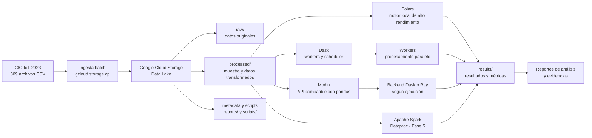

# Fase 3 — Diseño de Arquitectura Big Data

## 1. Objetivo

Diseñar la arquitectura que se utilizará para almacenar, procesar y analizar el dataset CIC-IoT-2023 en Google Cloud.

La arquitectura debe conectar la fuente de datos, la ingesta batch, el Data Lake y los motores de procesamiento distribuido, dejando trazables los resultados y las métricas de ciberseguridad.

## 2. Alcance

Esta fase define el diseño técnico y sus decisiones principales.

Incluye:

- Fuente de datos del proyecto.
- Ingesta batch de archivos CSV.
- Data Lake sobre Google Cloud Storage.
- Procesamiento con Polars, Dask, Modin y Apache Spark.
- Organización de datos procesados y resultados.
- Justificación de las decisiones tecnológicas.
- Relación con las fases posteriores.

No incluye la implementación de un clúster Dataproc, HDFS ni programas MapReduce. Esas actividades se implementarán en las fases posteriores.

**Nota de ejecución posterior:** este documento describe el diseño y el estado
al cerrar la Fase 3. La Fase 4 ejecutó Spark localmente. Dataproc y HDFS se
implementaron después, en la Fase 5; véase `05_fase5_hadoop/README.md`.
La estructura real de resultados es `results/fase4/<motor>/` y
`results/fase5/mapreduce/`, no los prefijos planos propuestos aquí.

Las operaciones de Spark de la Fase 4 podrán ejecutarse inicialmente en un entorno local o de laboratorio. El mismo código queda preparado para ejecutarse sobre Dataproc en la Fase 5.

## 3. Arquitectura propuesta



## 4. Componentes de la arquitectura

| Componente | Responsabilidad en el proyecto |
|---|---|
| CIC-IoT-2023 | Fuente original de datos, organizada en 34 clases de ataques y tráfico benigno. |
| Ingesta batch | Carga controlada y reproducible de los CSV hacia Google Cloud Storage. |
| Google Cloud Storage | Data Lake persistente, escalable y desacoplado del cómputo. |
| `raw/` | Zona de aterrizaje de los datos originales, sin transformación. |
| `processed/` | Muestra y archivos transformados listos para analítica. |
| `results/` | Resultados de Polars, Dask, Modin, Spark y MapReduce. |
| `reports/` | Reportes de calidad, métricas, análisis y evidencias. |
| `scripts/` | Código reproducible de ingesta y procesamiento. |
| Polars | Procesamiento local rápido y con baja sobrecarga para la muestra y transformaciones tabulares. |
| Dask | División de tareas y ejecución paralela y distribuida mediante workers. |
| Modin | API compatible con pandas; su backend podrá ser Dask o Ray. |
| Apache Spark | Procesamiento distribuido a escala, ejecutándose sobre Dataproc en una fase posterior. |
| Dataproc | Servicio administrado para Spark y Hadoop; todavía no está creado. |

## 5. Flujo de datos

1. El dataset original se encuentra organizado en 34 carpetas de clases y 309 archivos CSV.
2. Se realiza una ingesta batch usando `gcloud storage cp` con la opción `--no-clobber` para no sobrescribir objetos existentes.
3. Los archivos originales se almacenan en `gs://ciciot2023-bigdata-utec-proyecto1-gm/raw/`.
4. La muestra exacta de 600,000 registros se conserva en `processed/CICIoT2023_sample_600k.csv`.
5. Los motores de procesamiento leen los datos desde GCS o desde sus copias locales de trabajo.
6. Cada conjunto de operaciones escribe sus resultados en `results/polars/`, `results/dask/`, `results/modin/`, `results/spark/` o `results/mapreduce/`.
7. Las métricas, reportes de calidad y evidencias se almacenan en `reports/`.

## 6. Estructura del Data Lake

```text
gs://ciciot2023-bigdata-utec-proyecto1-gm/
├── raw/       # Dataset original, conservado sin transformaciones
├── processed/ # Muestra y datos transformados
├── results/   # Resultados de los motores de procesamiento
├── reports/   # Reportes de calidad, análisis y evidencias
└── scripts/   # Scripts de ingesta y procesamiento
```

La separación entre `raw/`, `processed/` y `results/` permite conservar la fuente, separar transformaciones de resultados y facilitar la reproducción de los experimentos.

## 7. Justificación técnica

### 7.1 Google Cloud Storage como Data Lake

GCS permite separar el almacenamiento del cómputo. Los datos pueden persistir aunque los motores de procesamiento se detengan o cambien. Además, ofrece control de acceso, metadatos, políticas de ciclo de vida y una interfaz común para las herramientas del proyecto.

### 7.2 Ingesta batch

El CIC-IoT-2023 es un dataset histórico y estático. No se requiere un sistema de streaming para recibir datos. La ingesta batch simplifica la trazabilidad, permite validar el conjunto completo antes de procesarlo y es más económica para este caso.

### 7.3 CSV y Parquet

Los CSV se conservan en `raw/` porque son el formato original y son compatibles con las herramientas existentes. Para resultados y conjuntos de datos transformados, Parquet puede utilizarse posteriormente porque es columnar, comprimido y eficiente para consultas analíticas.

### 7.4 Polars

Polars se utiliza para operaciones locales de alto rendimiento y baja sobrecarga. Es adecuado para la muestra de 600,000 registros y para transformaciones que no requieren un clúster.

### 7.5 Dask

Dask permite dividir un problema en tareas y ejecutarlas en paralelo. Es útil para aumentar el paralelismo sin abandonar el ecosistema de objetos tabulares tipo pandas.

### 7.6 Modin

Modin facilita escribir operaciones compatibles con pandas y puede utilizar Dask o Ray como backend. Esto permite comparar ejecuciones y mantener una interfaz conocida para el análisis.

### 7.7 Apache Spark y Dataproc

Spark es el motor principal para procesamiento distribuido de grandes volúmenes. Dataproc administra el clúster, los workers y las dependencias necesarias, evitando mantener servidores Hadoop propios.

### 7.8 Resultados separados

Guardar los resultados en `results/` evita sobrescribir la fuente o la muestra. También permite identificar qué motor generó cada archivo y reproducir los experimentos.

## 8. Seguridad y gobierno de datos

- El bucket utiliza uniform bucket-level access.
- Public access prevention está habilitado.
- No se almacenan tokens ni credenciales dentro del repositorio.
- Las operaciones posteriores utilizarán cuentas de servicio con permisos mínimos.
- Los datos raw no se versionan en Git.
- El dataset reducido se versiona mediante Git LFS.
- Los reportes de calidad deben conservarse para trazabilidad.

## 9. Estado actual y estado objetivo

| Elemento | Estado actual | Estado objetivo |
|---|---|---|
| Proyecto GCP | `bigdata-proyecto1-ciciot2023` activo | Mantener el proyecto como entorno de trabajo. |
| Bucket | Creado en `US-CENTRAL1` | Usar como Data Lake del proyecto. |
| `raw/` | 309 CSV originales cargados | Conservar sin modificaciones. |
| `processed/` | Muestra de 600,000 registros cargada | Añadir resultados transformados y Parquet cuando corresponda. |
| `reports/` | Reporte de calidad y documentación cargados | Añadir análisis y evidencias de cada fase. |
| `results/` | Prefijos preparados | Guardar resultados de cada motor. |
| Dataproc | API deshabilitada y sin clúster | Crear y usar en la fase de Hadoop/Dataproc. |
| GKE | No habilitado | No es necesario para este proyecto. |

## 10. Relación con las demás fases

- **Fase 1:** descarga, muestra y validación del dataset.
- **Fase 2:** proyecto, bucket, estructura e ingesta batch.
- **Fase 3:** diseño de esta arquitectura.
- **Fase 4:** operaciones con Polars, Dask, Modin y Spark.
- **Fase 5:** clúster Dataproc, HDFS y tres programas MapReduce.
- **Fase 6:** análisis de indicadores de ciberseguridad.
- **Fase 7:** informe final, código, evidencias y conclusiones.

## 11. Criterios de aceptación

- [x] Diagrama de arquitectura incluido mediante Mermaid.
- [x] Fuente de datos identificada.
- [x] Ingesta batch definida.
- [x] Data Lake y sus zonas documentados.
- [x] Componentes explicados.
- [x] Justificación técnica incluida.
- [x] Estado actual y objetivo diferenciados.
- [x] Límites con Dataproc, HDFS y MapReduce establecidos.

## 12. Conclusión

La arquitectura propuesta utiliza Google Cloud Storage como Data Lake y una ingesta batch para conservar el dataset original. Los motores de procesamiento se seleccionan según el tipo de operación: Polars para cálculo local, Dask y Modin para ejecución paralela o compatible con pandas, y Spark sobre Dataproc para procesamiento distribuido a mayor escala.

El diseño cumple los componentes obligatorios de la Fase 3: fuente de datos, ingesta batch, almacenamiento Data Lake y procesamiento distribuido. La implementación de Dataproc y MapReduce queda reservada para la Fase 5.
